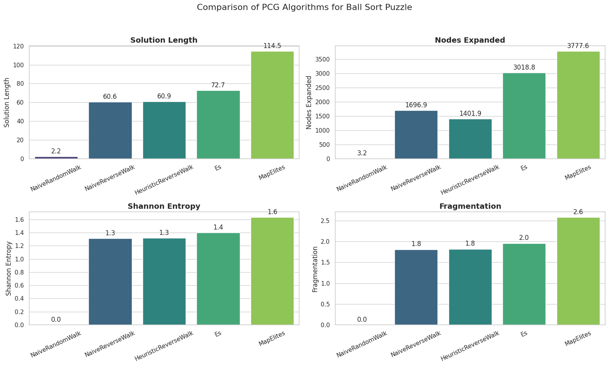

# Ball Sort Puzzle Color Sorting Game + PCG

**Authors:** Jakub Malczak, Piotr Stachowicz  
**Date:** February 5, 2026  
**Course:** Artificial Intelligence <3 Games: Procedural Content Generation

---

## 1. Introduction
This project explores procedural generation of **Ball Sort Puzzle** levels using **evolutionary algorithms**.
The goal is to investigate whether these methods can generate solvable and diverse puzzles comparable to levels produced by a classical **BFS-based search**. 
By comparing algorithmic and deterministic generation techniques, we aim to evaluate the potential of PCG to improve puzzle variety, difficulty control, and generation efficiency. The study contributes to understanding the applicability of evolutionary PCG methods in mobile puzzle games.

## 2. Background and Literature
Mobile puzzle games are widely popular, but many of them suffer from repetitive or poorly designed levels, which negatively impacts player engagement. 
Designing a large number of high-quality puzzle levels manually is difficult and time-consuming, 
making it a common bottleneck in puzzle game development.

Procedural Content Generation (PCG) provides a way to automatically generate puzzle levels and increase diversity. 
Although PCG has been extensively studied, puzzle generation remains a relatively underexplored area, as highlighted in existing surveys on procedural puzzle generation. 
In this project, the Ball Sort Puzzle is used as a test case to explore whether algorithmic generation methods can improve level variety and quality compared to traditional approaches.

[Procedural Puzzle Generation: A Survey](https://www.researchgate.net/publication/333226463_Procedural_Puzzle_Generation_A_Survey)

## 3. Methodology
The project is based on a comparative approach between two puzzle generation methods. 
The baseline method uses a classical search-based technique, 
where new Ball Sort Puzzle levels are generated by applying reverse moves from a solved state and verifying solvability using breadth-first search (BFS). 
Search depth is used as an estimate of puzzle difficulty.

The second method applies Procedural Content Generation using evolutionary techniques, such as genetic algorithms. 
Puzzle levels are treated as individuals in a population and evaluated using a fitness function that considers validity, solvability, and difficulty. 
The quality of levels generated by evolutionary methods is then compared to BFS-generated levels in terms of solvability, difficulty, diversity, and generation cost.


### 3.1. Solvers
- BFSSolver: Simple Breadth-first search solver,
- AStarSolver: Upgraded implementation of BFSSolver, which utilizes heuristic to speed up solving process.
- 
### 3.2. Agents
- HumanAgent: Agent that enables the user to play the game manually,
- SolverAgent: Agent which utilizes given solver to play the game.

### 3.3. Generators
- NaiveRandomWalk: Baseline content generator which does a number of random legal moves,
- NaiveReverseWalk: Does a specified amount of illegal random moves and then checks if the resulting content is solvable. If not, we repeat the process,
- HeuristicReverseWalk: Same as above, but utilizes heuristic to choose the illegal move,
- MapElites: Evolutionary generator, which is focused on generating quality content, whilst keeping somewhat diversity in the resulting set,
- Es (HillClimbing): Generates initial content with HeuristicReverseWalk, then at each step, it cuts the current move history and moves a specified amount of times. 

## 4. Experiments
Each of the generators proposes content population of size $n$. Then we take average over the population of metrics:
- Shannon Entropy: $H = -\sum p_i log_2(p_i)$,
- Fragmentation: Number of color changes in the flask from top to bottom,
- Nodes Expanded: Amount of nodes (states) that the utilized solver visited,
- Solution Length: Amount of nodes between the starting position and the result states.

## 5. Results


### 6. How to run the code
```
pip install -r requirements.txt
python3 run_game.py
```
